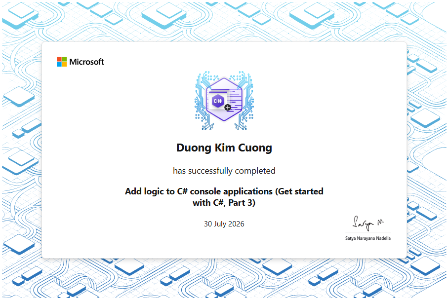
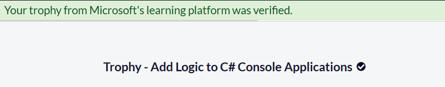

# Section 3 Trophy — Add Logic to C# Console Applications

This directory stores the official completion evidence for Section 3 of the
**Foundational C# with Microsoft Certification** curriculum delivered through
freeCodeCamp and Microsoft Learn.

## Completion Record

```text
Learner: Duong Kim Cuong
Section: Add Logic to C# Console Applications
Microsoft Learn path: Get started with C#, Part 3
Curriculum progress: 7 / 7
Instructional modules completed: 5
Guided projects completed: 1
Challenge projects completed: 1
Microsoft Learn completion certificate: Earned
freeCodeCamp Trophy verification: Passed
Section completion date: July 30, 2026
Repository validation: Verified
```

The evidence confirms completion of the complete Section 3 curriculum and
successful freeCodeCamp verification of the corresponding Microsoft Learn
Trophy.

---

## Evidence

### Microsoft Learn Completion Certificate



The certificate records that **Duong Kim Cuong** successfully completed:

```text
Add logic to C# console applications
(Get started with C#, Part 3)
```

Certificate date:

```text
30 July 2026
```

This certificate is evidence of completion on Microsoft Learn.

---

### freeCodeCamp Trophy Verification



The freeCodeCamp verification page displayed:

```text
Your trophy from Microsoft's learning platform was verified.
```

Verified Trophy:

```text
Trophy - Add Logic to C# Console Applications
```

This confirms that freeCodeCamp successfully recognized the Microsoft Learn
completion record for the section.

---

## Evidence Files

```text
trophy/
├── README.md
└── assets/
    ├── 1.PNG
    └── 2.PNG
```

The two files have distinct roles:

- `assets/1.PNG` records the Microsoft Learn completion certificate;
- `assets/2.PNG` records the successful freeCodeCamp Trophy verification.

Only official completion evidence is stored in this directory. Local build
screenshots are intentionally excluded because project and full-solution build
results are documented in the parent section README.

---

## Completed Curriculum

| No. | Curriculum item | Type | Status |
| ---: | --- | --- | --- |
| 1 | Evaluate Boolean Expressions to Make Decisions in C# | Instructional module | Completed |
| 2 | Control Variable Scope and Logic Using Code Blocks in C# | Instructional module | Completed |
| 3 | Branch the Flow of Code Using the `switch-case` Construct in C# | Instructional module | Completed |
| 4 | Iterate Through a Code Block Using the `for` Statement in C# | Instructional module | Completed |
| 5 | Add Looping Logic Using the `do-while` and `while` Statements in C# | Instructional module | Completed |
| 6 | Guided Project — Develop Conditional Branching and Looping Structures in C# | Guided project | Completed |
| 7 | Challenge Project — Develop Branching and Looping Structures in C# | Challenge project | Completed |

Final progress:

```text
7 / 7 — Completed
```

---

## Repository Validation

The final challenge project is located at:

```text
curriculum/add-logic-to-csharp-console-applications/
└── challenge-projects/
    └── contoso-pets-challenge/
        ├── Program.cs
        └── contoso-pets-challenge.csproj
```

Validation commands:

```powershell
dotnet run --project `
  ".\curriculum\add-logic-to-csharp-console-applications\challenge-projects\contoso-pets-challenge\contoso-pets-challenge.csproj"

dotnet build `
  ".\curriculum\add-logic-to-csharp-console-applications\challenge-projects\contoso-pets-challenge\contoso-pets-challenge.csproj"

dotnet build .\freecodecamp-csharp.slnx
```

Verified result:

```text
Challenge project run: Succeeded
Challenge behavior: Verified
Challenge project build: Succeeded in 0.9 seconds
Full solution build: Succeeded in 2.6 seconds
Build warnings: 0
Build errors: 0
Registered solution projects: 20
Verification date: July 30, 2026
```

---

## Section Outcomes

The completed section demonstrates practical use of:

```text
Boolean expressions
Conditional operators
if / else branching
switch-case branching
Variable scope and code blocks
for iteration
while iteration
do-while iteration
continue and break
Console-input validation
int.TryParse()
Null-safe string handling
Two-dimensional arrays
Method extraction
Maintainable program structure
```

The final Contoso Pets challenge completes missing animal data while preserving
the existing menu and data model.

---

## Navigation

- [← Back to Section 3 documentation](../README.md)
- [← Back to repository overview](../../../README.md)
- [Open the challenge project](../challenge-projects/contoso-pets-challenge/)
- [Proceed to Section 4](../../work-with-variable-data-in-csharp-console-applications/README.md)
