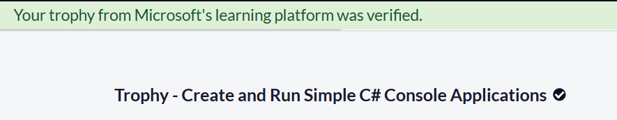
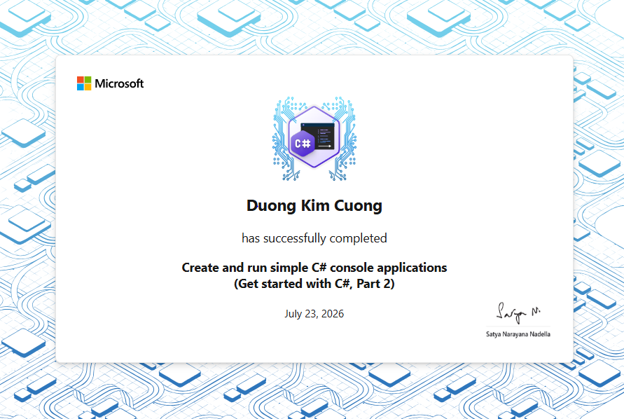

# Section 2 Trophy — Create and Run Simple C# Console Applications


This directory stores completion evidence for Section 2 of the
**Foundational C# with Microsoft Certification** curriculum.

## Completion Record

```text
Learner: Duong Kim Cuong
Section: Create and Run Simple C# Console Applications
Microsoft Learn path: Get started with C#, Part 2
Curriculum progress: 7 / 7
freeCodeCamp completion: Confirmed
Microsoft Learn achievement: Earned
Completion date: July 23, 2026
```

## Evidence

### freeCodeCamp Section Completion



The screenshot confirms completion of:

```text
Create and Run Simple C# Console Applications
```

### Microsoft Learn Achievement



The achievement records that **Duong Kim Cuong** successfully completed:

```text
Create and run simple C# console applications
(Get started with C#, Part 2)
```

Achievement date:

```text
July 23, 2026
```

## Repository Validation

Official curriculum completion and achievement evidence are stored here.

Repository validation was completed successfully on July 23, 2026:

```powershell
dotnet run --project `
  ".\curriculum\create-and-run-simple-csharp-console-applications\challenge-projects\student-grading-challenge\student-grading-challenge.csproj"

dotnet build `
  ".\curriculum\create-and-run-simple-csharp-console-applications\challenge-projects\student-grading-challenge\student-grading-challenge.csproj"

dotnet build .\freecodecamp-csharp.slnx
```

Verified result:

```text
Challenge project run: Succeeded
Challenge project output: Matched expected values
Challenge project build: Succeeded
Full solution build: Succeeded
Registered solution projects: 13
```

[← Back to Section 2 documentation](../README.md)

[← Back to repository overview](../../../README.md)
