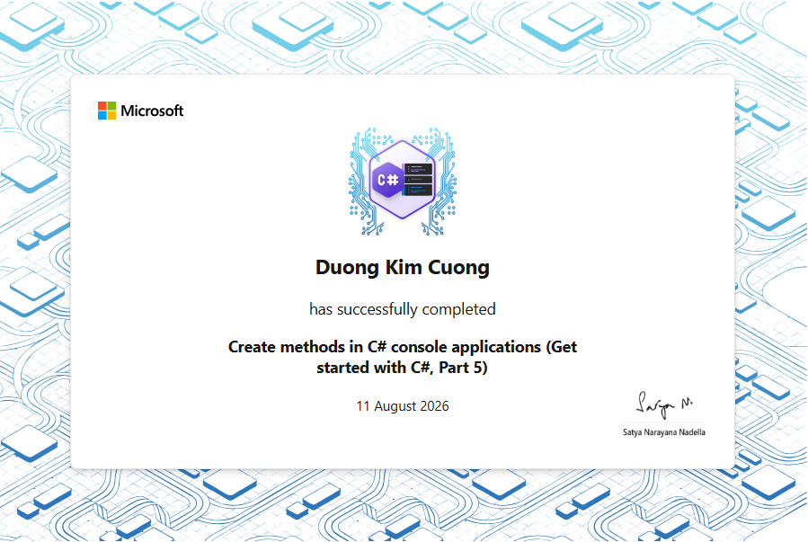
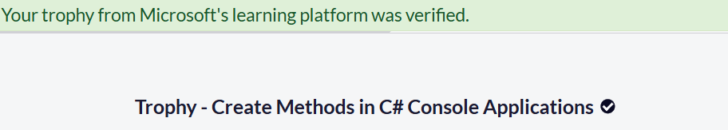

# Section 5 Trophy — Create Methods in C# Console Applications

Completion evidence for Section 5 of the **Foundational C# with Microsoft
Certification** curriculum.

## Completion Status

```text
Learning path: Create Methods in C# Console Applications
Section position: 5 / 7
Section learning progress: 5 / 5
Repository verification progress: 5 / 5
Status: Completed
Instructional modules completed: 3
Guided projects completed: 1
Challenge projects completed: 1
Final challenge: Challenge Project — Create a Mini-Game
Challenge Microsoft Learn units: 7 / 7
Challenge module assessment: Passed
Learning-path assessments: All passed
Achievements earned on completion page: 2
Final solution project count: 32
Target framework: net10.0
Final challenge project build: Succeeded in 0.9 seconds
Final full-solution build: Succeeded in 5.9 seconds
Compiler errors: 0
Compiler warnings: 0
IDE diagnostics: No issues found
Completion date: August 11, 2026
```

---

## Achievement Evidence

### Section completion certificate



The certificate image records completion of the Section 5 learning path.

### Microsoft Learn achievement page



The achievement page confirms:

```text
Create methods in C# console applications
→ All module assessments passed

Challenge project — Create a mini-game
→ Module assessment passed

Achievements earned on the completion page
→ 2
```

---

## Completed Curriculum Items

| No. | Curriculum item | Status |
| ---: | --- | --- |
| 1 | Write Your First C# Method | Completed |
| 2 | Create C# Methods with Parameters | Completed |
| 3 | Create C# Methods That Return Values | Completed |
| 4 | Guided Project — Plan a Petting Zoo Visit | Completed |
| 5 | Challenge Project — Create a Mini-Game | Completed |

All five learning items are preserved as runnable projects or documented
project checkpoints inside the repository.

---

## Section 5 Learning Progression

Section 5 develops one continuous method-design model:

```text
Module 1
named methods
→ reusable behavior

Module 2
parameters and arguments
→ explicit input

Module 3
return values
→ explicit output

Guided Project
method composition
→ complete application workflow

Challenge Project
game loop + game state + method coordination
→ interactive application architecture
```

The final result is a complete **input → processing → output → next state**
workflow implemented with cooperating methods.

---

## Final Challenge — Mini-Game Architecture

The final **Create a Mini-Game** project demonstrates a small but complete game
architecture.

Core loop:

```text
initialize game state
    ↓
read player input
    ↓
update player position
    ↓
check terminal state
    ↓
detect food collision
    ↓
apply player-state effect
    ↓
spawn new food
    ↓
render the next state
    ↓
repeat until termination
```

The project introduces the idea that an application can be modeled as a
continuously changing **state** rather than as one linear sequence of
statements.

---

## Final Challenge Capabilities

The completed mini-game demonstrates:

- initializing player and food state;
- reading keyboard input with `Console.ReadKey(...)`;
- moving the player with arrow keys;
- constraining player coordinates to the terminal bounds;
- detecting terminal resizing;
- terminating safely when the terminal dimensions change;
- detecting food consumption through coordinate comparison;
- generating food at random positions;
- assigning food types through a shared index;
- changing player appearance after food consumption;
- representing normal, fast, and frozen player states;
- applying temporary freeze behavior;
- applying faster horizontal movement;
- using optional parameters in `Move(...)`;
- using named arguments when calling methods;
- optionally terminating on unsupported keys;
- erasing the previous player position before redrawing;
- maintaining shared game state across loop iterations;
- coordinating multiple focused methods inside a game loop.

Final challenge project:

```text
curriculum/create-methods-in-csharp-console-applications/
└── challenge-projects/
    └── create-mini-game/
        ├── Program.cs
        └── create-mini-game.csproj
```

---

## Core Game State

The final challenge uses a small set of variables to represent the current
world state:

```text
playerX / playerY
→ current player position

foodX / foodY
→ current food position

player
→ current player appearance and gameplay state

food
→ current food type

shouldExit
→ controls the game-loop lifetime
```

Together these variables form the game's **state**.

Each loop iteration reads or changes that state.

---

## Collision Detection

The challenge implements a dedicated Boolean method:

```csharp
bool GotFood()
```

Conceptually:

```text
playerX == foodX
        +
playerY == foodY
        ↓
true / false
```

This is the project's collision-detection rule.

When the method returns `true`:

```text
food consumed
    ↓
ChangePlayer()
    ↓
ShowFood()
```

The old food affects the player and a new food object is generated.

---

## Player State Transitions

The game connects food types and player states through matching array indexes:

```text
@@@@@
→ ('-')
→ normal state

$$$$$
→ (^-^)
→ fast state

#####
→ (X_X)
→ temporary frozen state
```

The state transition is implemented by using the current food index to select
the corresponding player state.

This provides a compact example of data-driven behavior.

---

## Optional Parameters in Real Application Logic

The movement method uses:

```csharp
void Move(
    int speed = 1,
    bool otherKeysExit = false)
```

The two optional parameters now have real runtime meaning:

```text
speed
→ horizontal movement distance

otherKeysExit
→ whether unsupported input terminates the game
```

Normal movement can omit `speed`:

```csharp
Move(
    otherKeysExit: true);
```

Fast movement can override it:

```csharp
Move(
    speed: 3,
    otherKeysExit: true);
```

This is a practical application of the optional-parameter concepts introduced
earlier in Section 5.

---

## Boolean Methods as Game Rules

The final challenge uses several Boolean-returning methods:

```text
TerminalResized()
→ Is the terminal still valid?

GotFood()
→ Did the player reach the food?

PlayerIsSick()
→ Is the frozen state active?

PlayerIsFaster()
→ Is the fast state active?
```

This allows the game loop to read almost like a sequence of questions about
the current state.

---

## Repository Implementation Note

The completed repository version follows the written challenge requirement for
the fast-player state:

```text
normal horizontal movement
→ 1 column per key press

fast horizontal movement
→ 3 columns per key press
```

The implementation keeps that behavior explicit through a dedicated movement
speed configuration instead of leaving the fast state at normal speed.

The optional unsupported-key termination behavior is also enabled and
documented in the final source.

---

## Repository Verification

Final repository evidence:

```text
Challenge project registered in solution: Verified
Registered solution projects: 32
Challenge project build: Succeeded in 0.9 seconds
Full solution build: Succeeded in 5.9 seconds
Compiler errors: 0
Compiler warnings: 0
IDE diagnostics: No issues found
Mini-game runtime: Verified
Arrow-key movement: Verified
Food rendering: Verified
Player-state rendering: Verified
Terminal game loop: Verified
Trophy directory: Added
Trophy assets: 2 PNG files
```

Build the final challenge independently:

```powershell
dotnet build `
  ".\curriculum\create-methods-in-csharp-console-applications\challenge-projects\create-mini-game\create-mini-game.csproj"
```

Build the complete solution:

```powershell
dotnet build .\freecodecamp-csharp.slnx
```

Run the final challenge:

```powershell
dotnet run --project `
  ".\curriculum\create-methods-in-csharp-console-applications\challenge-projects\create-mini-game\create-mini-game.csproj"
```

Recommended runtime checks:

```text
Arrow keys
→ player moves inside the terminal bounds

@@@@@
→ player uses normal state

$$$$$
→ player enters fast state
→ horizontal movement uses the increased step

#####
→ player enters frozen state
→ movement pauses temporarily
→ player returns to normal state

Player reaches food coordinates
→ food is consumed
→ player state changes
→ new food is generated

Unsupported key
→ game terminates when optional exit behavior is enabled

Resize terminal
→ "Console was resized. Program exiting."
```

---

## Key Terms

| Term | IPA | Approximate reading | Meaning |
| --- | --- | --- | --- |
| trophy | `/ˈtrəʊ.fi/` | “trâu-phi” | bằng chứng hoặc thành tích hoàn thành |
| achievement | `/əˈtʃiːv.mənt/` | “ờ-chiv-mần-t” | thành tích |
| mini-game | `/ˈmɪn.i ɡeɪm/` | “mi-ni gâym” | trò chơi nhỏ |
| game loop | `/ɡeɪm luːp/` | “gâym luup” | vòng lặp chính của trò chơi |
| game state | `/ɡeɪm steɪt/` | “gâym stâyt” | trạng thái hiện tại của trò chơi |
| collision detection | `/kəˈlɪʒ.ən dɪˈtek.ʃən/` | “cờ-li-zhần đi-téc-shần” | phát hiện va chạm |
| state transition | `/steɪt trænˈzɪʃ.ən/` | “stâyt tran-zi-shần” | chuyển đổi trạng thái |
| movement | `/ˈmuːv.mənt/` | “muuv-mần-t” | sự di chuyển |
| freeze | `/friːz/` | “friiz” | đóng băng / tạm dừng chuyển động |
| terminate | `/ˈtɜː.mɪ.neɪt/` | “tơ-mi-nâyt” | kết thúc chương trình |
| optional parameter | `/ˈɒp.ʃən.əl pəˈræm.ɪ.tər/` | “óp-shờ-nồ pờ-ram-mi-tờ” | tham số tùy chọn |
| method composition | `/ˈmeθ.əd ˌkɒm.pəˈzɪʃ.ən/` | “me-thợd com-pờ-zi-shần” | kết hợp nhiều method thành workflow |
| assessment | `/əˈses.mənt/` | “ờ-sét-mần-t” | bài đánh giá |
| completion evidence | `/kəmˈpliː.ʃən ˈev.ɪ.dəns/` | “cầm-pli-shần e-vi-đần-x” | bằng chứng hoàn thành |

---

## Completion Record

```text
Curriculum section: Create Methods in C# Console Applications
Section position: 5 / 7
Learning progress: 5 / 5
Repository verification: 5 / 5
Status: Completed
Instructional modules: 3 / 3
Guided projects: 1 / 1
Challenge projects: 1 / 1
Final learning item: Challenge Project — Create a Mini-Game
Challenge units: 7 / 7
Challenge assessment: Passed
Learning-path assessments: All passed
Achievements shown: 2
Solution projects: 32
Final challenge build: Succeeded in 0.9 seconds
Final full-solution build: Succeeded in 5.9 seconds
Compiler errors: 0
Compiler warnings: 0
IDE diagnostics: No issues found
Trophy assets: 1.PNG, 2.PNG
Completion date: August 11, 2026
```

---

## Navigation

- [Section 5 documentation](../README.md)
- [Challenge Project source](../challenge-projects/create-mini-game/)
- [Guided Project source](../guided-projects/plan-petting-zoo-visit/)
- [Repository overview](../../../README.md)
