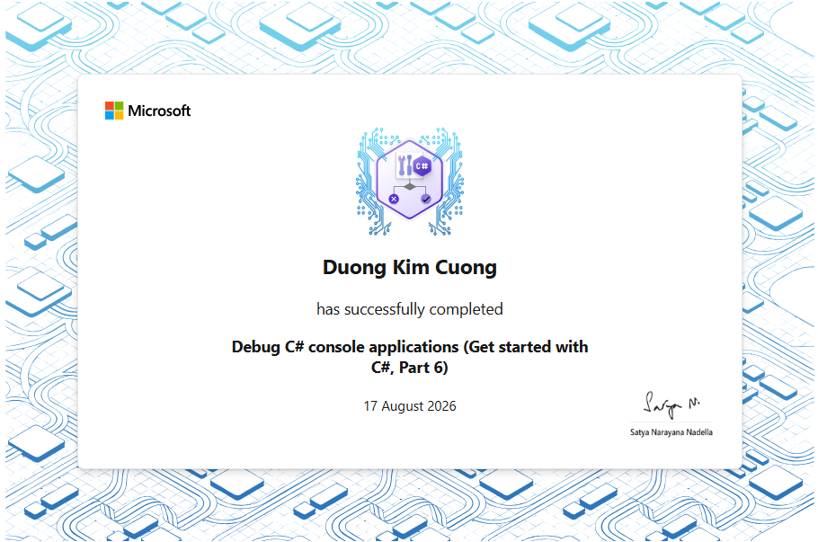
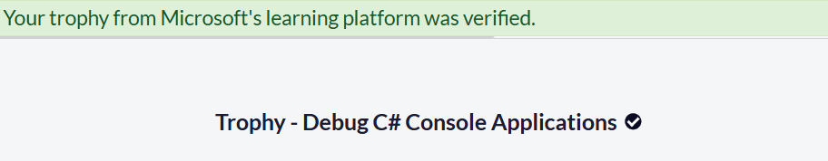

# Section 6 Trophy — Debug C# Console Applications

Completion evidence for Section 6 of the Foundational C# with Microsoft Certification curriculum.

## Completion Status

```text
Learning path: Debug C# Console Applications
Microsoft Learn path: Debug C# console applications (Get started with C#, Part 6)
Section position: 6 / 7
Section learning progress: 6 / 6
Repository verification progress: 6 / 6
Status: Completed
Instructional modules completed: 4
Guided projects completed: 1
Challenge projects completed: 1
Final challenge: Challenge Project — Debug a C# Console Application Using Visual Studio Code
Challenge Microsoft Learn units: 6 / 6
Challenge module assessment: Passed
Learning-path assessments: All passed
Achievements shown on completion page: 2
Final solution project count: 38
Target framework: net10.0
Final organized Program.cs: Completed
Professional source comments: Completed
Final challenge runtime: Verified
Final reported till value: Equal to expected till value
Final full-solution build: Succeeded in 3.2 seconds
IDE diagnostics: No issues found
Trophy evidence: Verified
```

---

## Achievement Evidence

### Section completion certificate

The first evidence image records completion of the Section 6 learning path.



### Microsoft Learn achievement page

The second evidence image records the final Microsoft Learn completion state for Section 6.



The achievement evidence confirms:

```text
Debug C# console applications
(Get started with C#, Part 6)
→ All module assessments passed

Challenge Project — Debug a C# Console Application Using Visual Studio Code
→ Module assessment passed

Achievements shown on completion page
→ 2
```

---

## Completed Curriculum Items

| No. | Curriculum item | Type | Status |
| ---: | --- | --- | --- |
| 1 | Review the Principles of Code Debugging and Exception Handling | Instructional module | Completed |
| 2 | Implement the Visual Studio Code Debugging Tools for C# | Instructional module | Completed |
| 3 | Implement Exception Handling in C# Console Applications | Instructional module | Completed |
| 4 | Create and Throw Exceptions in C# Console Applications | Instructional module | Completed |
| 5 | Guided Project — Debug and Handle Exceptions in a C# Console Application Using Visual Studio Code | Guided project | Completed |
| 6 | Challenge Project — Debug a C# Console Application Using Visual Studio Code | Challenge project | Completed |

All six learning items are preserved as runnable projects or documented project checkpoints inside the repository.

---

## Section 6 Learning Progression

Section 6 develops one continuous debugging and exception-handling model:

```text
Module 1
debugging principles
+ software testing responsibilities
+ exception fundamentals
        ↓
understand failure categories

Module 2
breakpoints
+ stepping
+ variable inspection
+ call stack
+ debugger configuration
        ↓
observe runtime behavior

Module 3
try
+ catch
+ finally
+ exception propagation
        ↓
handle runtime failures

Module 4
create exception objects
+ throw
+ rethrow
+ InnerException
+ method contracts
        ↓
design explicit failure behavior

Guided Project
cash-register application
+ debugger-guided investigation
+ logic-bug correction
+ exception-based transaction flow
        ↓
combine debugging and exception handling

Challenge Project
100 randomized transactions
+ isolate remaining state corruption
+ stage transaction state
+ commit only on success
        ↓
balanced till after success and failure paths
```

The final result is a complete progression from observing defects to designing code that preserves valid state when operations fail.

---

## Final Challenge — Cash Register Debugging Architecture

The final challenge uses a cash-register application that tracks the number of bills available in a till.

The denomination model is:

```text
cashTill[0]
→ $1 bills

cashTill[1]
→ $5 bills

cashTill[2]
→ $10 bills

cashTill[3]
→ $20 bills
```

Starting cash is loaded through:

```text
LoadTillEachMorning()
```

Transactions are processed through:

```text
MakeChange()
```

Current till inventory is reported through:

```text
LogTillStatus()
```

The monetary value represented by the till is reported through:

```text
TillAmountSummary()
```

An independent value named:

```text
registerCheckTillTotal
```

acts as a second source of truth.

The application is considered balanced when:

```text
TillAmountSummary(cashTill)
        =
registerCheckTillTotal
```

---

## Challenge Simulation Requirements

The final challenge is configured to:

```text
use randomly generated item costs
itemCost range: 2 through 49
attempted transactions: 100
```

The application must exercise both failure conditions:

```text
InvalidOperationException
→ Not enough money provided to complete the transaction.

InvalidOperationException
→ The till is unable to make change for the cash provided.
```

The final verification requirement is:

```text
reported till value
        =
expected till value
```

One verified repository run ended with:

```text
The till has 1281 dollars
Expected till value: 1281
```

The exact total varies because the transaction data is randomized.

---

## Guided Project Bug — Five-Dollar Bill Index

The Guided Project identified an earlier denomination-index defect.

The condition checked:

```csharp
cashTill[1]
```

which correctly represents five-dollar bills.

The original state mutation incorrectly used:

```csharp
cashTill[2]--;
```

which removes a ten-dollar bill.

The corrected mutation is:

```csharp
cashTill[1]--;
```

The defect demonstrated an important debugging lesson:

```text
program executes
      ↓
console output appears plausible
      ↓
internal state is incorrect
      ↓
independent safety check exposes mismatch
      ↓
debugger isolates incorrect array mutation
```

This bug was corrected before the final Challenge Project.

---

## Final Challenge Root Cause

The remaining challenge defect was different from the five-dollar indexing issue.

The starter transaction logic modified the real till before it knew whether a transaction could complete successfully.

Conceptually, the failing design was:

```text
customer payment
      ↓
mutate cashTill immediately
      ↓
begin preparing change
      ↓
transaction fails
      ↓
throw InvalidOperationException
      ↓
partial cashTill changes remain
```

The caller correctly avoided increasing:

```text
registerCheckTillTotal
```

for failed transactions.

However, the real `cashTill` had already changed.

This produced:

```text
failed transaction
      ↓
expected total unchanged
      ↓
actual till mutated
      ↓
reported total ≠ expected total
```

The bug was therefore a **state-consistency defect**, not simply a wrong arithmetic expression.

---

## Transaction Staging

The final solution stages the proposed transaction in local variables:

```csharp
int availableTwenties =
    cashTill[3] +
    twenties;

int availableTens =
    cashTill[2] +
    tens;

int availableFives =
    cashTill[1] +
    fives;

int availableOnes =
    cashTill[0] +
    ones;
```

These variables represent the temporary state that would exist if the transaction succeeds.

The real till remains unchanged while change is being calculated.

The transaction model becomes:

```text
current cashTill
      ↓
copy + customer payment
      ↓
temporary available... state
      ↓
attempt to produce exact change
      ↓
      ┌─────────────────────┐
      │                     │
   success                failure
      │                     │
      ↓                     ↓
commit staged state      throw exception
to cashTill              discard local state
      │                     │
      └──────────┬──────────┘
                 ↓
        cashTill remains valid
```

This makes the operation effectively atomic from the caller's perspective.

---

## Failure Case 1 — Customer Underpayment

The payment value is calculated from the bills supplied by the customer.

```csharp
int amountPaid =
    twenties * 20 +
    tens * 10 +
    fives * 5 +
    ones;
```

Required change is:

```csharp
int changeNeeded =
    amountPaid -
    cost;
```

If:

```text
changeNeeded < 0
```

the customer has not supplied enough money.

The method throws:

```csharp
throw new InvalidOperationException(
    "InvalidOperationException: Not enough money provided to " +
    "complete the transaction.");
```

Because the real `cashTill` has not been committed yet, the failed transaction leaves the register unchanged.

---

## Failure Case 2 — Till Cannot Make Exact Change

The method attempts to return change from the largest available denomination to the smallest:

```text
$20
 ↓
$10
 ↓
$5
 ↓
$1
```

If change still remains after all available denominations have been considered:

```text
changeNeeded > 0
```

the till cannot produce exact change.

The method throws:

```csharp
throw new InvalidOperationException(
    "InvalidOperationException: The till is unable to make change " +
    "for the cash provided.");
```

Again, the staged local state is discarded and the real till remains unchanged.

---

## Commit Only After Success

The real cash register is updated only after all validation and change-making steps succeed:

```csharp
cashTill[0] =
    availableOnes;

cashTill[1] =
    availableFives;

cashTill[2] =
    availableTens;

cashTill[3] =
    availableTwenties;
```

The transaction therefore follows:

```text
prepare
   ↓
validate
   ↓
stage
   ↓
verify exact change
   ↓
commit
```

rather than:

```text
mutate
   ↓
discover failure
   ↓
attempt to recover
```

This is the central engineering lesson of the final challenge.

---

## Exception Boundary

The caller treats `MakeChange()` as a transaction boundary.

```csharp
try
{
    MakeChange(
        itemCost,
        cashTill,
        paymentTwenties,
        paymentTens,
        paymentFives,
        paymentOnes);

    registerCheckTillTotal +=
        itemCost;
}
catch (InvalidOperationException exception)
{
    Console.WriteLine(
        $"Could not complete transaction: {exception.Message}");
}
```

Successful execution means:

```text
MakeChange() returned normally
        ↓
cashTill committed
        ↓
expected till increases by itemCost
```

Failed execution means:

```text
MakeChange() threw
        ↓
cashTill unchanged
        ↓
expected till unchanged
```

The actual and expected models therefore remain synchronized.

---

## Final Challenge Capabilities

The completed challenge demonstrates:

- configuring randomized test data;
- generating item costs in the required `2..49` range;
- simulating 100 transaction attempts;
- maintaining a bill-denomination data model;
- calculating customer payment from multiple bill types;
- calculating required change;
- returning change by denomination;
- throwing `InvalidOperationException` for customer underpayment;
- throwing `InvalidOperationException` when exact change cannot be made;
- using `try-catch` around a transaction boundary;
- using `Exception.Message` for failure reporting;
- isolating logic defects with debugger tools;
- distinguishing output symptoms from the true internal-state defect;
- using independent expected-state verification;
- staging transaction changes in local variables;
- preventing failed transactions from corrupting shared state;
- committing state only when the complete operation succeeds;
- verifying actual and expected till totals after each transaction;
- preserving a balanced till across both successful and failed transaction paths.

Final challenge project:

```text
curriculum/debug-csharp-console-applications/
└── challenge-projects/
    └── debug-csharp-console-application/
        ├── Program.cs
        └── debug-csharp-console-application.csproj
```

---

## Debugging Workflow

The final challenge demonstrates a practical debugger workflow:

```text
1. reproduce the problem
        ↓
2. compare actual and expected state
        ↓
3. identify when divergence begins
        ↓
4. set breakpoints around MakeChange()
        ↓
5. inspect cashTill before and after failures
        ↓
6. step through payment and change logic
        ↓
7. isolate the first invalid state mutation
        ↓
8. redesign the transaction boundary
        ↓
9. rerun randomized verification
        ↓
10. confirm reported till = expected till
```

This is a stronger debugging process than modifying code based only on guesses about the visible output.

---

## Debugger Tools Reinforced by Section 6

The section reinforces the use of:

```text
breakpoints
step over
step into
step out
continue
variable inspection
watch expressions
call stack
exception information
integrated terminal
runtime-state comparison
```

The debugger is used to answer questions such as:

```text
What value changed?
When did it change?
Which method changed it?
Which path led to the failure?
Was shared state already mutated before the exception?
```

---

## Exception-Handling Model

Section 6 develops the following exception model:

```text
method receives input
      ↓
validate method contract
      ↓
can operation complete?
   ┌──┴───┐
  yes     no
   ↓       ↓
continue  create specific exception
            ↓
           throw
            ↓
       call-stack search
            ↓
        catch handler
            ↓
recover / report / rethrow
```

The final challenge extends this model with state protection:

```text
operation may fail
      ↓
do not commit shared state early
      ↓
stage locally
      ↓
commit only after success
```

---

## Repository Verification

Final repository evidence:

```text
Challenge project registered in solution: Verified
Registered solution projects: 38
Challenge project runtime: Verified
Random transaction simulation: 100 attempts
Random item-cost range: 2 through 49
Underpayment exception path: Implemented
Insufficient-change exception path: Implemented
Failed-transaction state preservation: Implemented
Reported till equals expected till: Verified
Observed final reported till: 1281 dollars
Observed final expected till: 1281 dollars
Final organized Program.cs: Completed
Professional source comments: Completed
Full solution build: Succeeded in 3.2 seconds
IDE diagnostics: No issues found
Trophy directory: Added
Trophy assets: 2 PNG files
```

Build the final challenge independently:

```powershell
dotnet build `
  ".\curriculum\debug-csharp-console-applications\challenge-projects\debug-csharp-console-application\debug-csharp-console-application.csproj"
```

Build the complete solution:

```powershell
dotnet build .\freecodecamp-csharp.slnx
```

Run the final challenge:

```powershell
dotnet run --project `
  ".\curriculum\debug-csharp-console-applications\challenge-projects\debug-csharp-console-application\debug-csharp-console-application.csproj"
```

Recommended runtime checks:

```text
100 transaction attempts
→ present

itemCost values
→ generated from 2 through 49

Insufficient customer payment
→ InvalidOperationException is reported

Till unable to make exact change
→ InvalidOperationException is reported

Failed transaction
→ expected total is unchanged
→ actual cashTill is unchanged

Successful transaction
→ actual till increases by itemCost
→ expected till increases by itemCost

End of simulation
→ reported till value = expected till value
```

---

## Key Terms

| Term | IPA | Approximate reading | Meaning |
| --- | --- | --- | --- |
| debugging | `/ˌdiːˈbʌɡ.ɪŋ/` | “đi-bấ-ging” | quá trình tìm và sửa lỗi chương trình |
| debugger | `/ˌdiːˈbʌɡ.ər/` | “đi-bấ-gờ” | công cụ hỗ trợ quan sát và gỡ lỗi chương trình |
| breakpoint | `/ˈbreɪk.pɔɪnt/` | “brâyk-point” | điểm tạm dừng chương trình khi debug |
| logic bug | `/ˈlɒdʒ.ɪk bʌɡ/` | “lo-jik bấg” | lỗi logic khiến chương trình cho trạng thái hoặc kết quả sai |
| exception | `/ɪkˈsep.ʃən/` | “ịch-sep-shần” | ngoại lệ / lỗi runtime có cấu trúc |
| exception handling | `/ɪkˈsep.ʃən ˈhæn.dəl.ɪŋ/` | “ịch-sep-shần han-đờ-ling” | cơ chế xử lý ngoại lệ |
| call stack | `/ˈkɔːl stæk/` | “co:l stæk” | ngăn xếp các lời gọi method đang hoạt động |
| transaction | `/trænˈzæk.ʃən/` | “tran-zắc-shần” | một thao tác nghiệp vụ cần hoàn thành nhất quán |
| transaction state | `/trænˈzæk.ʃən steɪt/` | “tran-zắc-shần stâyt” | trạng thái dữ liệu của một giao dịch |
| staged state | `/steɪdʒd steɪt/` | “stâydjd stâyt” | trạng thái tạm trước khi commit |
| commit | `/kəˈmɪt/` | “cờ-mít” | xác nhận và ghi trạng thái cuối thành công |
| rollback | `/ˈrəʊl.bæk/` | “rôul-bắc” | hoàn tác hoặc khôi phục trạng thái trước giao dịch |
| atomic operation | `/əˈtɒm.ɪk ˌɒp.əˈreɪ.ʃən/` | “ờ-tom-ik op-pờ-rây-shần” | thao tác được nhìn như thành công toàn bộ hoặc không thay đổi gì |
| state consistency | `/steɪt kənˈsɪs.tən.si/` | “stâyt cờn-sis-tần-si” | tính nhất quán của trạng thái dữ liệu |
| safety check | `/ˈseɪf.ti tʃek/` | “sâyp-ti chek” | phép kiểm tra độc lập để phát hiện sai lệch |
| assessment | `/əˈses.mənt/` | “ờ-sét-mần-t” | bài đánh giá |
| achievement | `/əˈtʃiːv.mənt/` | “ờ-chiv-mần-t” | thành tích |
| completion evidence | `/kəmˈpliː.ʃən ˈev.ɪ.dəns/` | “cầm-pli-shần e-vi-đần-x” | bằng chứng hoàn thành |

---

## Completion Record

```text
Curriculum section: Debug C# Console Applications
Microsoft Learn path: Debug C# console applications (Get started with C#, Part 6)
Section position: 6 / 7
Learning progress: 6 / 6
Repository verification: 6 / 6
Status: Completed
Instructional modules: 4 / 4
Guided projects: 1 / 1
Challenge projects: 1 / 1
Final learning item: Challenge Project — Debug a C# Console Application Using Visual Studio Code
Challenge units: 6 / 6
Challenge assessment: Passed
Learning-path assessments: All passed
Achievements shown: 2
Solution projects: 38
Final challenge runtime: Verified
Reported till equals expected till: Verified
Full solution build: Succeeded in 3.2 seconds
IDE diagnostics: No issues found
Trophy assets: 1.PNG, 2.PNG
```

---

## Curriculum Sources

- [Microsoft Learn — Debug C# console applications (Get started with C#, Part 6)](https://learn.microsoft.com/en-us/training/paths/get-started-c-sharp-part-6/)
- [Microsoft Learn — Review the Principles of Code Debugging and Exception Handling](https://learn.microsoft.com/en-us/training/modules/review-principles-code-debugging-exception-handling-c-sharp/)
- [Microsoft Learn — Implement the Visual Studio Code Debugging Tools for C#](https://learn.microsoft.com/en-us/training/modules/implement-visual-studio-code-debugging-tools/)
- [Microsoft Learn — Implement Exception Handling in C# Console Applications](https://learn.microsoft.com/en-us/training/modules/implement-exception-handling-c-sharp/)
- [Microsoft Learn — Create and Throw Exceptions in C# Console Applications](https://learn.microsoft.com/en-us/training/modules/create-throw-exceptions-c-sharp/)
- [Microsoft Learn — Guided Project: Debug and Handle Exceptions in a C# Console Application Using Visual Studio Code](https://learn.microsoft.com/en-us/training/modules/guided-project-debug-handle-exceptions-c-sharp-console-application/)
- [Microsoft Learn — Challenge Project: Debug a C# Console Application Using Visual Studio Code](https://learn.microsoft.com/en-us/training/modules/challenge-project-debug-c-sharp-console-application/)

---

## Navigation

- [Section 6 documentation](../README.md)
- [Challenge Project source](../challenge-projects/debug-csharp-console-application/)
- [Guided Project source](../guided-projects/debug-handle-exceptions/)
- [Repository overview](../../../README.md)
