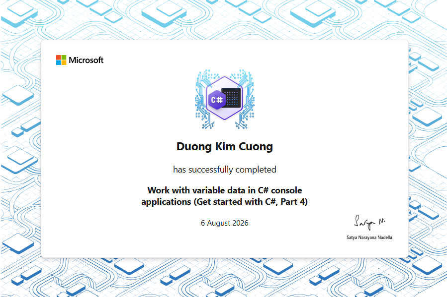
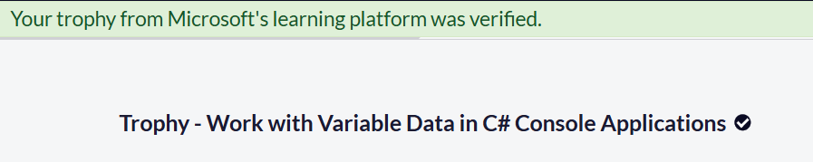

# Section 4 Trophy — Work with Variable Data in C# Console Applications

Completion evidence for Section 4 of the **Foundational C# with Microsoft
Certification** curriculum.

## Completion Status

```text
Learning path: Work with Variable Data in C# Console Applications
Section position: 4 / 7
Section learning progress: 7 / 7
Repository verification progress: 7 / 7
Status: Completed
Instructional modules completed: 5
Guided projects completed: 1
Challenge projects completed: 1
Final challenge: Challenge Project — Work with Variable Data in C#
Challenge Microsoft Learn units: 6 / 6
Challenge module assessment: Passed
Learning-path assessments: All passed
Achievements earned on completion page: 2
Final solution project count: 27
Target framework: net10.0
Final full-solution build: Succeeded in 2.3 seconds
Compiler errors: 0
IDE diagnostics: No issues found
Completion date: August 6, 2026
```

---

## Achievement Evidence

### Section completion certificate



The certificate image records completion of the Section 4 learning path.

### Microsoft Learn achievement page



The achievement page confirms:

```text
Work with variable data in C# console applications
→ All module assessments passed

Challenge project — Work with variable data in C#
→ Module assessment passed

Achievements earned on the completion page
→ 2
```

---

## Completed Curriculum Items

| No. | Curriculum item | Status |
| ---: | --- | --- |
| 1 | Choose the Correct Data Type in Your C# Code | Completed |
| 2 | Convert Data Types Using Casting and Conversion Techniques in C# | Completed |
| 3 | Perform Operations on Arrays Using Helper Methods in C# | Completed |
| 4 | Format Alphanumeric Data for Presentation in C# | Completed |
| 5 | Modify the Content of Strings Using Built-In String Data Type Methods in C# | Completed |
| 6 | Guided Project — Work with Variable Data in C# | Completed |
| 7 | Challenge Project — Work with Variable Data in C# | Completed |

All seven learning items are preserved as runnable projects or documented
project checkpoints inside the repository.

---

## Final Challenge Capabilities

The final **Contoso PetFriends Challenge** project demonstrates:

- accepting several comma-separated dog characteristics;
- validating null, empty, and delimiter-only input;
- splitting one input string into a `string[]`;
- trimming each search term;
- sorting terms alphabetically without case sensitivity;
- iterating through all available dog records;
- searching combined physical and personality descriptions;
- reporting every term matched by each dog;
- displaying each matching dog's details once;
- reporting clearly when no dog matches;
- rendering a rotating search-status spinner;
- displaying the required countdown from `2` to `0`;
- removing the animation cleanly after each search;
- formatting suggested donations with stable culture settings;
- preserving safe menu input and normal application exit.

Final challenge project:

```text
curriculum/work-with-variable-data-in-csharp-console-applications/
└── challenge-projects/
    └── contoso-petfriends-challenge/
        ├── Program.cs
        └── contoso-petfriends-challenge.csproj
```

---

## Repository Verification

Final repository evidence:

```text
Challenge project registered in solution: Verified
Registered solution projects: 27
Challenge project build: Succeeded
Full solution build: Succeeded in 2.3 seconds
Compiler errors: 0
IDE diagnostics: No issues found
Trophy directory: Added
Trophy assets: 2 PNG files
```

Build the final challenge independently:

```powershell
dotnet build `
  ".\curriculum\work-with-variable-data-in-csharp-console-applications\challenge-projects\contoso-petfriends-challenge\contoso-petfriends-challenge.csproj"
```

Build the complete solution:

```powershell
dotnet build .\freecodecamp-csharp.slnx
```

Run the final challenge:

```powershell
dotnet run --project `
  ".\curriculum\work-with-variable-data-in-csharp-console-applications\challenge-projects\contoso-petfriends-challenge\contoso-petfriends-challenge.csproj"
```

Recommended final runtime checks:

```text
Search: large, cream, golden
→ lola matches cream and golden
→ gus matches golden and large

Search: big, grey, stripes
→ no-match message is displayed

Search: golden, big
→ terms are processed in sorted order
→ spinner is shown
→ countdown displays 2, 1, 0

Exit
→ application terminates normally
```

---

## Key Terms

| Term | IPA | Approximate reading | Meaning |
| --- | --- | --- | --- |
| trophy | `/ˈtrəʊ.fi/` | “trâu-phi” | bằng chứng hoặc thành tích hoàn thành |
| achievement | `/əˈtʃiːv.mənt/` | “ờ-chiv-mần-t” | thành tích |
| challenge project | `/ˈtʃæl.ɪndʒ ˈprɒdʒ.ekt/` | “cha-lần-ch pro-jẹct” | dự án thử thách |
| multiple-term search | `/ˈmʌl.tɪ.pəl tɜːm sɜːtʃ/` | “man-ti-pồ tơm sớt-ch” | tìm kiếm bằng nhiều từ khóa |
| spinner | `/ˈspɪn.ər/` | “spi-nờ” | biểu tượng quay thể hiện tiến trình |
| countdown | `/ˈkaʊnt.daʊn/` | “cao-nt-đao-n” | đếm ngược |
| assessment | `/əˈses.mənt/` | “ờ-sét-mần-t” | bài đánh giá |
| completion evidence | `/kəmˈpliː.ʃən ˈev.ɪ.dəns/` | “cầm-pli-shần e-vi-đần-x” | bằng chứng hoàn thành |

---

## Completion Record

```text
Curriculum section: Work with Variable Data in C# Console Applications
Section position: 4 / 7
Learning progress: 7 / 7
Repository verification: 7 / 7
Status: Completed
Final learning item: Challenge Project — Work with Variable Data in C#
Challenge units: 6 / 6
Challenge assessment: Passed
Learning-path assessments: All passed
Achievements shown: 2
Solution projects: 27
Final full-solution build: Succeeded in 2.3 seconds
Trophy assets: 1.PNG, 2.PNG
Completion date: August 6, 2026
```

---

## Navigation

- [Section 4 documentation](../README.md)
- [Challenge Project source](../challenge-projects/contoso-petfriends-challenge/)
- [Guided Project source](../guided-projects/contoso-petfriends/)
- [Repository overview](../../../README.md)
