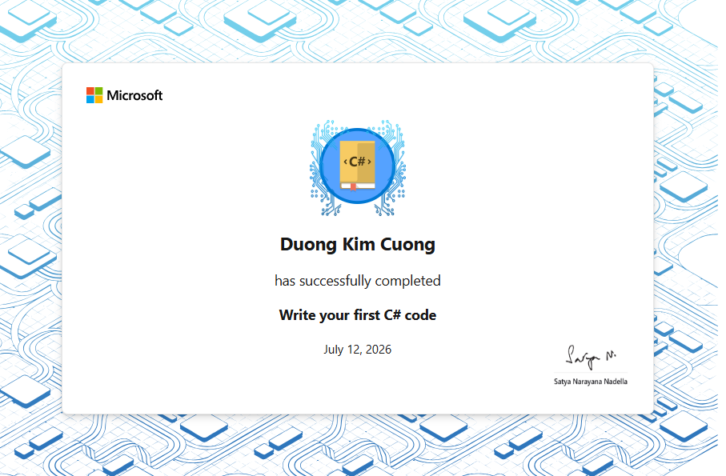
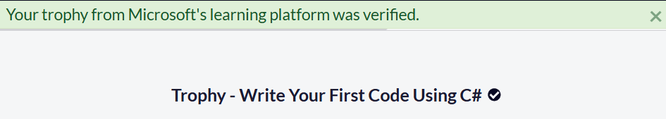

# Trophy — Write Your First Code Using C#

## Verification Status

```text
Status: Completed
Section progress: 7 / 7
Microsoft Learn achievement: Earned
freeCodeCamp trophy verification: Passed
Section completion date: July 17, 2026
```

The Microsoft Learn achievement associated with the first C# curriculum section
was successfully earned and subsequently verified by freeCodeCamp.

The freeCodeCamp verification page displayed the following confirmation:

```text
Your trophy from Microsoft's learning platform was verified.
```

---

## Completion Evidence

### Microsoft Learn Achievement

Microsoft Learn records completion of the introductory module:

```text
Achievement: Write your first C# code
Learner: Duong Kim Cuong
Completion date: July 12, 2026
Platform: Microsoft Learn
```



This achievement confirms completion of the introductory Microsoft Learn module
that covers the first C# statements and console output.

---

### freeCodeCamp Trophy Verification

After all required Microsoft Learn modules and guided projects were completed,
freeCodeCamp successfully verified the Trophy for the complete section.

```text
Trophy: Write Your First Code Using C#
Verification result: Passed
Verification date: July 17, 2026
Platform: freeCodeCamp
```



This verification confirms that all required curriculum items in the section
were completed.

---

## Completed Section

```text
Section: Write Your First Code Using C#
Progress: 7 / 7
Status: Completed
```

The completed section contains:

```text
Instructional modules completed: 4
Guided projects completed: 2
Verified trophies completed: 1
Total curriculum items completed: 7
```

---

## Completed Instructional Modules

1. Write Your First C# Code
2. Store and Retrieve Data Using Literal and Variable Values in C#
3. Perform Basic String Formatting in C#
4. Perform Basic Operations on Numbers in C#

---

## Completed Guided Projects

### Calculate and Print Student Grades

Repository location:

```text
curriculum/write-your-first-code-using-csharp/guided-projects/calculate-student-grades/
```

This project calculates student averages and prints a formatted grade report.

### Calculate Final GPA

Repository location:

```text
curriculum/write-your-first-code-using-csharp/guided-projects/calculate-final-gpa/
```

This project calculates a weighted GPA using course grades and credit hours.

---

## Evidence Files

The completion evidence is stored in:

```text
trophy/
├── README.md
└── assets/
    ├── microsoft-learn-achievement-write-your-first-csharp-code-2026-07-12.png
    └── trophy-verified-2026-07-17.png
```

The two images serve different purposes:

- `microsoft-learn-achievement-write-your-first-csharp-code-2026-07-12.png`
  records the Microsoft Learn achievement for the introductory module;
- `trophy-verified-2026-07-17.png`
  records the successful freeCodeCamp verification of the completed section.

---

## Curriculum Documentation

For the complete section documentation, including:

- module summaries;
- guided-project explanations;
- C# concepts learned;
- project locations;
- run commands;
- expected output;
- build instructions;
- section progress;

see:

[Write Your First Code Using C# — Curriculum Documentation](../README.md)

---

## Next Curriculum Section

The next section is:

```text
Create and Run Simple C# Console Applications
```

This next section builds on the syntax, variables, formatting, arithmetic,
casting, and problem-solving skills completed in this section.